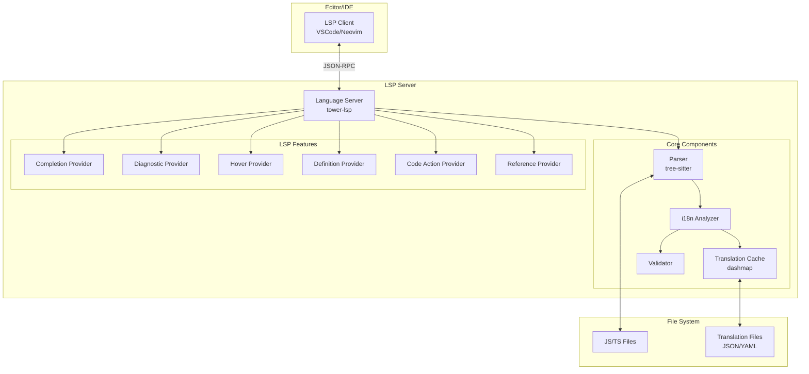
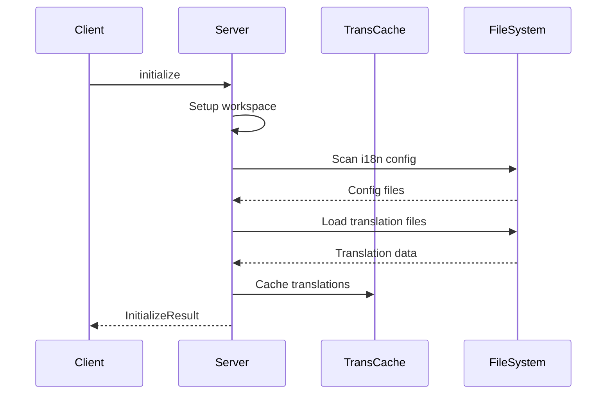
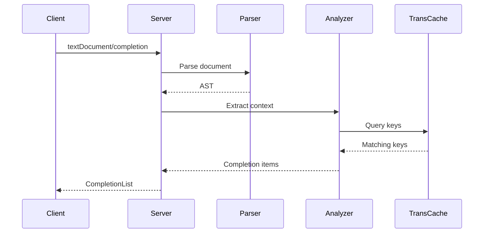
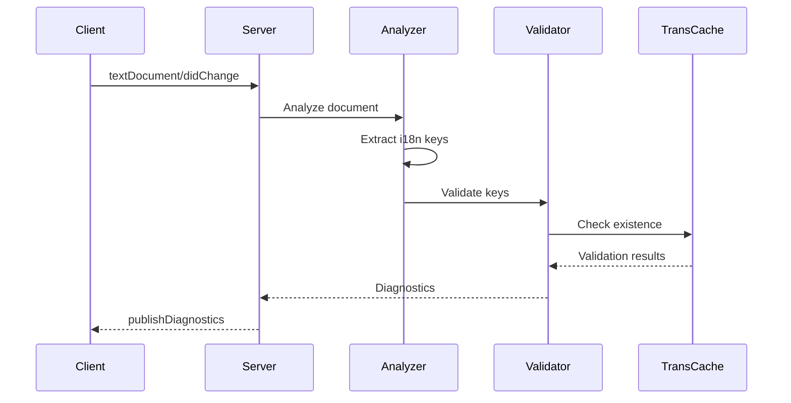

## 1. エグゼクティブサマリー

JS i18n Language Serverは、JavaScript/TypeScriptプロジェクトにおける国際化開発を支援するLSPサーバーです。翻訳キーの自動補完、リアルタイム検証、インテリジェントなコード支援機能により、開発者の生産性を大幅に向上させます。Rustとtower-lspを基盤とし、高パフォーマンスと拡張性を実現します。

**関連文書:**

- PRD: [/docs/prd.md](/docs/prd.md)
- 主要ADR: [ADR-001 技術スタック選定](/docs/adr/ADR-001-technology-stack-selection.md), [ADR-002 テスト戦略](/docs/adr/ADR-002-test-strategy-and-coverage.md)

## 2. システム概要

### 2.1 システム構成図



### 2.2 主要コンポーネント

| コンポーネント      | 責務                              | 技術             |
| ------------------- | --------------------------------- | ---------------- |
| Language Server     | LSPプロトコル処理、リクエスト管理 | tower-lsp, tokio |
| Parser              | ソースコード構文解析              | tree-sitter      |
| i18n Analyzer       | 翻訳キー抽出、使用箇所分析        | Rust             |
| Translation Cache   | 翻訳ファイルのメモリキャッシュ    | dashmap          |
| Validator           | 翻訳キー検証、整合性チェック      | Rust             |
| Completion Provider | 自動補完候補生成                  | Rust             |
| Diagnostic Provider | エラー・警告生成                  | Rust             |

## 3. 技術選択

| 領域                 | 技術             | 選択理由                                 |
| -------------------- | ---------------- | ---------------------------------------- |
| 言語                 | Rust             | 高パフォーマンス、メモリ安全性 [ADR-001] |
| LSPフレームワーク    | tower-lsp        | 非同期処理、実績あり [ADR-001]           |
| 非同期ランタイム     | tokio            | 効率的なI/O処理 [ADR-001]                |
| 構文解析             | tree-sitter      | インクリメンタル解析 [ADR-001]           |
| キャッシュ           | dashmap          | 並行アクセス対応HashMap                  |
| シリアライゼーション | serde/serde_json | LSPプロトコル処理                        |
| ファイル監視         | LSP標準          | workspace/didChangeWatchedFiles使用      |

## 4. データフロー設計

### 4.1 初期化フロー



### 4.2 補完リクエストフロー



### 4.3 診断フロー



## 5. コア機能の詳細設計

### 5.1 翻訳キー抽出

**対応パターン:**

```javascript
// 関数呼び出し
t('user.profile.name')
i18n.t('user.profile.name')
$t('user.profile.name')

// テンプレートリテラル（静的解析可能な場合）
t(`user.${staticValue}.name`)

// React/Vue コンポーネント
<Trans i18nKey="user.profile.name" />
```

**抽出アルゴリズム:**

1. tree-sitterでASTを生成
2. 関数呼び出しノードを走査
3. i18n関数パターンにマッチする呼び出しを検出
4. 第一引数から翻訳キーを抽出
5. ネームスペース情報があれば結合

### 5.2 翻訳ファイル管理

**サポートフォーマット:**

- JSON: 標準的なkey-valueフォーマット
- YAML: 人間に優しい記法

**ファイル検出戦略:**

1. プロジェクトルートから設定ファイル検索（i18n.config.js等）
2. 一般的なディレクトリパターン検索（locales/, i18n/）
3. package.jsonのi18n設定確認

### 5.3 キャッシュ戦略

```rust
struct TranslationCache {
    // locale -> namespace -> key -> value
    translations: DashMap<String, DashMap<String, DashMap<String, String>>>,
    // ファイルパス -> 最終更新時刻
    file_timestamps: DashMap<PathBuf, SystemTime>,
}
```

**更新戦略:**

- ファイル変更検知時に該当部分のみ更新
- インクリメンタルな更新でパフォーマンス維持

## 6. 非機能要件の実現

### 6.1 パフォーマンス

| 指標           | 目標値            | 実現方法                         |
| -------------- | ----------------- | -------------------------------- |
| 補完レスポンス | <100ms            | メモリキャッシュ、インデックス化 |
| 初期化時間     | <3秒（1000キー）  | 並列ファイル読み込み             |
| メモリ使用量   | <50MB（1000キー） | 効率的なデータ構造               |

**最適化戦略:**

- 翻訳キーのトライ木構造でプレフィックス検索を高速化
- ファイルI/Oの非同期並列処理
- 変更差分のみの再解析

### 6.2 信頼性

- **エラーハンドリング:** 翻訳ファイルのパースエラーでもサーバーは停止しない
- **部分的機能提供:** 一部の翻訳ファイルが壊れていても、他の機能は継続
- **グレースフルリカバリ:** ファイル修正時に自動的に機能回復

### 6.3 拡張性

**プラグインアーキテクチャ:**

```rust
trait I18nLibraryAdapter {
    fn detect_pattern(&self, node: &Node) -> Option<String>;
    fn extract_key(&self, node: &Node) -> Option<String>;
    fn resolve_namespace(&self, key: &str) -> String;
}
```

**サポートライブラリの追加が容易:**

- i18next
- react-i18next
- vue-i18n
- next-intl

## 7. エラー処理とロギング

### 7.1 エラーレベル

| レベル  | 例                         | 処理                     |
| ------- | -------------------------- | ------------------------ |
| Error   | 翻訳ファイルが見つからない | 診断メッセージ、機能制限 |
| Warning | 未使用の翻訳キー           | 診断メッセージ           |
| Info    | サーバー初期化完了         | ログ出力                 |

### 7.2 ロギング戦略

```rust
// 構造化ログ with tracing
tracing::info!(
    translation_files = ?files.len(),
    initialization_time = ?elapsed,
    "Translation cache initialized"
);
```

## 8. テスト戦略

**テストピラミッド:** [ADR-002参照]

- ユニットテスト（40%）: パーサー、キー抽出ロジック
- 統合テスト（30%）: LSPプロトコル動作
- E2Eテスト（10%）: エディタとの統合
- プロパティテスト（10%）: エッジケース検証
- スナップショット（5%）: LSPレスポンス形式
- パフォーマンス（5%）: ベンチマーク

## 9. セキュリティ考慮事項

- **ファイルアクセス:** ワークスペース外のファイルアクセスを制限
- **サニタイゼーション:** 翻訳キーに含まれる特殊文字を適切にエスケープ
- **リソース制限:** 巨大ファイルに対するメモリ使用量制限

## 10. 今後の検討事項

- **機械翻訳統合:** 翻訳APIとの連携
- **翻訳管理システム連携:** Crowdin, Phraseなどとの統合
- **プレースホルダー型チェック:** TypeScript型情報との連携
- **翻訳カバレッジレポート:** 未翻訳キーの可視化

## 11. 参考資料

- [Language Server Protocol Specification](https://microsoft.github.io/language-server-protocol/)
- [tower-lsp Documentation](https://github.com/ebkalderon/tower-lsp)
- [tree-sitter Documentation](https://tree-sitter.github.io/tree-sitter/)

