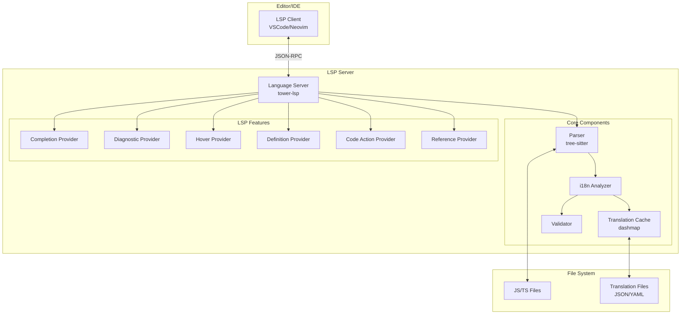
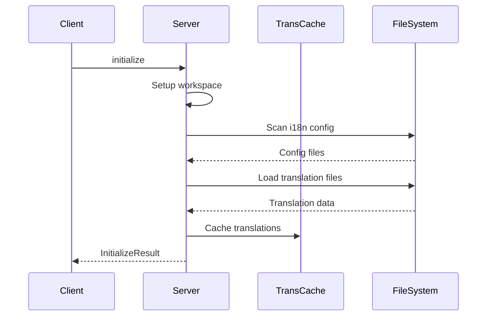
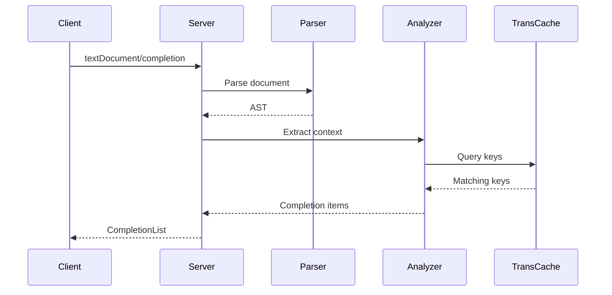
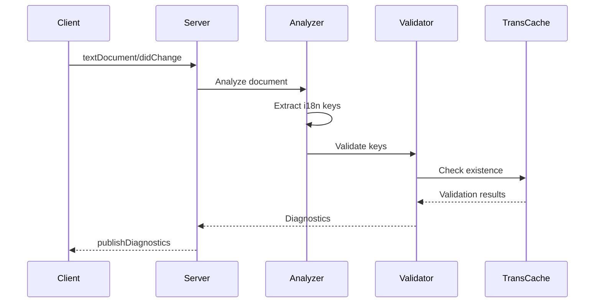

## 1. エグゼクティブサマリー

JS i18n Language Serverは、JavaScript/TypeScriptプロジェクトにおける国際化開発を支援するLSPサーバーです。翻訳キーの自動補完、リアルタイム検証、インテリジェントなコード支援機能により、開発者の生産性を大幅に向上させます。Rustとtower-lspを基盤とし、高パフォーマンスと拡張性を実現します。

**関連文書:**

- PRD: [/docs/prd.md](/docs/prd.md)
- 主要ADR: [ADR-001 技術スタック選定](/docs/adr/ADR-001-technology-stack-selection.md), [ADR-002 テスト戦略](/docs/adr/ADR-002-test-strategy-and-coverage.md)

## 2. システム概要

### 2.1 システム構成図


```mermaid
graph TB
    subgraph "Editor/IDE"
        Client[LSP Client<br/>VSCode/Neovim]
    end

    subgraph "LSP Server"
        Server[Language Server<br/>tower-lsp]

        subgraph "Core Components"
            Parser[Parser<br/>tree-sitter]
            Analyzer[i18n Analyzer]
            TransCache[Translation Cache<br/>dashmap]
            Validator[Validator]
        end

        subgraph "LSP Features"
            Completion[Completion Provider]
            Diagnostic[Diagnostic Provider]
            Hover[Hover Provider]
            Definition[Definition Provider]
            CodeAction[Code Action Provider]
            Reference[Reference Provider]
        end
    end

    subgraph "File System"
        JSFiles[JS/TS Files]
        I18nFiles[Translation Files<br/>JSON/YAML]
    end

    Client <-->|JSON-RPC| Server
    Server --> Parser
    Parser --> Analyzer
    Analyzer --> TransCache
    Analyzer --> Validator

    Server --> Completion
    Server --> Diagnostic
    Server --> Hover
    Server --> Definition
    Server --> CodeAction
    Server --> Reference

    Parser <--> JSFiles
    TransCache <--> I18nFiles
```

### 2.2 主要コンポーネント

| コンポーネント      | 責務                              | 技術             |
| ------------------- | --------------------------------- | ---------------- |
| Language Server     | LSPプロトコル処理、リクエスト管理 | tower-lsp, tokio |
| Parser              | ソースコード構文解析              | tree-sitter      |
| i18n Analyzer       | 翻訳キー抽出、使用箇所分析        | Rust             |
| Translation Cache   | 翻訳ファイルのメモリキャッシュ    | dashmap          |
| Validator           | 翻訳キー検証、整合性チェック      | Rust             |
| Completion Provider | 自動補完候補生成                  | Rust             |
| Diagnostic Provider | エラー・警告生成                  | Rust             |

## 3. 技術選択

| 領域                 | 技術             | 選択理由                                 |
| -------------------- | ---------------- | ---------------------------------------- |
| 言語                 | Rust             | 高パフォーマンス、メモリ安全性 [ADR-001] |
| LSPフレームワーク    | tower-lsp        | 非同期処理、実績あり [ADR-001]           |
| 非同期ランタイム     | tokio            | 効率的なI/O処理 [ADR-001]                |
| 構文解析             | tree-sitter      | インクリメンタル解析 [ADR-001]           |
| キャッシュ           | dashmap          | 並行アクセス対応HashMap                  |
| シリアライゼーション | serde/serde_json | LSPプロトコル処理                        |
| ファイル監視         | LSP標準          | workspace/didChangeWatchedFiles使用      |

## 4. データフロー設計

### 4.1 初期化フロー


```mermaid
sequenceDiagram
    participant Client
    participant Server
    participant TransCache
    participant FileSystem

    Client->>Server: initialize
    Server->>Server: Setup workspace
    Server->>FileSystem: Scan i18n config
    FileSystem-->>Server: Config files
    Server->>FileSystem: Load translation files
    FileSystem-->>Server: Translation data
    Server->>TransCache: Cache translations
    Server-->>Client: InitializeResult
```

### 4.2 補完リクエストフロー


```mermaid
sequenceDiagram
    participant Client
    participant Server
    participant Parser
    participant Analyzer
    participant TransCache

    Client->>Server: textDocument/completion
    Server->>Parser: Parse document
    Parser-->>Server: AST
    Server->>Analyzer: Extract context
    Analyzer->>TransCache: Query keys
    TransCache-->>Analyzer: Matching keys
    Analyzer-->>Server: Completion items
    Server-->>Client: CompletionList
```

### 4.3 診断フロー


```mermaid
sequenceDiagram
    participant Client
    participant Server
    participant Analyzer
    participant Validator
    participant TransCache

    Client->>Server: textDocument/didChange
    Server->>Analyzer: Analyze document
    Analyzer->>Analyzer: Extract i18n keys
    Analyzer->>Validator: Validate keys
    Validator->>TransCache: Check existence
    TransCache-->>Validator: Validation results
    Validator-->>Server: Diagnostics
    Server-->>Client: publishDiagnostics
```

## 5. コア機能の詳細設計

### 5.1 翻訳キー抽出

**対応パターン:**

```javascript
// 関数呼び出し
t('user.profile.name')
i18n.t('user.profile.name')
$t('user.profile.name')

// テンプレートリテラル（静的解析可能な場合）
t(`user.${staticValue}.name`)

// React/Vue コンポーネント
<Trans i18nKey="user.profile.name" />
```

**抽出アルゴリズム:**

1. tree-sitterでASTを生成
2. 関数呼び出しノードを走査
3. i18n関数パターンにマッチする呼び出しを検出
4. 第一引数から翻訳キーを抽出
5. ネームスペース情報があれば結合

### 5.2 翻訳ファイル管理

**サポートフォーマット:**

- JSON: 標準的なkey-valueフォーマット
- YAML: 人間に優しい記法

**ファイル検出戦略:**

1. プロジェクトルートから設定ファイル検索（i18n.config.js等）
2. 一般的なディレクトリパターン検索（locales/, i18n/）
3. package.jsonのi18n設定確認

### 5.3 キャッシュ戦略

```rust
struct TranslationCache {
    // locale -> namespace -> key -> value
    translations: DashMap<String, DashMap<String, DashMap<String, String>>>,
    // ファイルパス -> 最終更新時刻
    file_timestamps: DashMap<PathBuf, SystemTime>,
}
```

**更新戦略:**

- ファイル変更検知時に該当部分のみ更新
- インクリメンタルな更新でパフォーマンス維持

## 6. コアシステムアーキテクチャ

### 6.1 インデックスシステム設計

i18n Language Serverの中核となる、翻訳キーの参照（Reference）を管理するインデックスシステムの詳細設計です。

#### 6.1.1 ファイルID管理

メモリ効率化のため、ファイルパスを数値IDで管理します：

```rust
// ファイルパスを32ビット整数で管理
type FileId = u32;

struct FileIdManager {
    // 双方向マッピング
    path_to_id: DashMap<PathBuf, FileId>,
    id_to_path: DashMap<FileId, PathBuf>,
    next_id: AtomicU32,
}
```

**メリット:**
- PathBuf（可変長）→ u32（4バイト固定）でメモリ使用量を大幅削減
- 参照情報の保存時に4バイトで済む
- 高速な双方向検索が可能

#### 6.1.2 翻訳キー参照（Reference）管理

各翻訳キーの使用箇所を効率的に追跡：

```rust
#[derive(Clone, Debug)]
struct TranslationReference {
    file_id: FileId,                    // 4 bytes
    line: u32,                          // 4 bytes  
    column: u32,                        // 4 bytes
    trans_key_hash: u64,                // 8 bytes (文言キーのハッシュ)
    namespace_hash: Option<u64>,        // 8 bytes
    // 合計: 28 bytes per reference
}

struct TranslationReferenceIndex {
    // trans_key → reference箇所リスト
    references: DashMap<String, Vec<TranslationReference>>,
    // ファイル → そのファイル内のreference（高速更新用）
    file_references: DashMap<FileId, Vec<TranslationReference>>,
}
```

**設計ポイント:**
- 参照1つあたり28バイトの固定サイズ
- ハッシュ値による高速比較
- ファイル単位での効率的な更新

#### 6.1.3 翻訳リソース管理

翻訳ファイルの内容を効率的にキャッシュ：

```rust
struct TranslationResource {
    file_id: FileId,
    namespace: Option<String>,
    keys: DashSet<String>,
    last_modified: SystemTime,
}

struct TranslationResourceManager {
    resources: DashMap<FileId, TranslationResource>,
    all_keys: DashSet<String>,  // 未使用キー検出用
}
```

### 6.2 ファイル解析システム

#### 6.2.1 tree-sitterクエリベースの解析エンジン

tree-sitterのクエリ機能を活用して、i18n関数やコンポーネントを正確に抽出します。

```rust
// i18nライブラリ別クエリ管理（js-i18n.nvimベース）
struct TranslationQueries {
    // i18next/react-i18next
    i18next_trans_f_call: Query,     // trans_f_call: 文言取得関数の呼び出し
    i18next_trans_f: Query,          // trans_f: 文言取得関数の定義
    react_i18next_trans_component: Query, // Transコンポーネント
    
    // next-intl
    next_intl_use_translations: Query,
    next_intl_trans_f_call: Query,
    
    // 共通
    import_statements: Query,
}

// スコープ管理用の情報
#[derive(Clone, Debug)]
struct ScopeInfo {
    t_func_name: String,             // "t", "tl" など
    namespace: Option<String>,       // 名前空間
    key_prefix: Option<String>,      // キープレフィックス
    scope_node: tree_sitter::Node,   // スコープ範囲
}

// i18nextライブラリの実際のクエリ（js-i18n.nvimから移植）
const I18NEXT_TRANS_F_CALL_QUERY: &str = r#"
; trans_f_call（文言取得関数の呼び出し）
(call_expression
  function: [
    (identifier)
    (member_expression)
  ] @i18n.t_func_name
    arguments: (arguments
      (string
        (string_fragment) @i18n.key
      ) @i18n.key_arg
    )
) @i18n.call_t

; オプション付きt()呼び出し
(call_expression
  function: [
    (identifier)
    (member_expression)
  ] @i18n.t_func_name
    arguments: (arguments
      (string
        (string_fragment) @i18n.key
      ) @i18n.key_arg
      (object) @i18n.options
    )
) @i18n.call_t
"#;

const I18NEXT_TRANS_F_QUERY: &str = r#"
; trans_f（文言取得関数の定義）useTranslation()フック
(call_expression
  function: (identifier) @i18n.hook_name (#eq? @i18n.hook_name "useTranslation")
  arguments: (arguments
    (string
      (string_fragment) @i18n.namespace
    ) @i18n.namespace_arg
    (object
      (pair
        key: (property_identifier) @i18n.keyPrefix_key (#eq? @i18n.keyPrefix_key "keyPrefix")
        value: (string
          (string_fragment) @i18n.key_prefix
        ) @i18n.key_prefix_arg
      )
    ) @i18n.options
  )
) @i18n.get_t

; シンプルなuseTranslation()
(call_expression
  function: (identifier) @i18n.hook_name (#eq? @i18n.hook_name "useTranslation")
) @i18n.get_t
"#;

const REACT_I18NEXT_TRANS_QUERY: &str = r#"
; <Trans i18nKey="key" />
(
  jsx_self_closing_element
    name: (identifier) @trans (#eq? @trans "Trans")
    attribute: (jsx_attribute
      (property_identifier) @i18n_key (#eq? @i18n_key "i18nKey")
      [
       (string (string_fragment) @i18n.key) @i18n.key_arg
       (jsx_expression
         (string (string_fragment) @i18n.key) @i18n.key_arg
       )
      ]
    )
    attribute: (jsx_attribute
      (property_identifier) @attr_t (#eq? @attr_t "t")
      (jsx_expression
        (identifier) @i18n.t_func_name
      )
    ) 
) @i18n.call_t

; <Trans>コンポーネントのオープンタグ
(
  jsx_opening_element
    name: (identifier) @trans (#eq? @trans "Trans")
    attribute: (jsx_attribute
      (property_identifier) @i18n_key (#eq? @i18n_key "i18nKey")
      [
       (string (string_fragment) @i18n.key) @i18n.key_arg
       (jsx_expression
         (string (string_fragment) @i18n.key) @i18n.key_arg
       )
      ]
    )
) @i18n.call_t
"#;

const IMPORT_STATEMENTS_QUERY: &str = r#"
; i18next関連のimport文
(import_declaration
  source: (string
    (string_fragment) @import.source (#match? @import.source "(i18next|react-i18next|next-intl)")
  )
  specifiers: (import_clause
    (named_imports
      (import_specifier
        name: (identifier) @import.name
        alias: (identifier) @import.alias
      )
    )
  )
) @import.declaration

; デフォルトimport
(import_declaration
  source: (string
    (string_fragment) @import.source (#match? @import.source "(i18next|react-i18next|next-intl)")
  )
  specifiers: (import_clause
    default: (identifier) @import.default
  )
) @import.declaration
"#;
```

**クエリベース解析の利点:**
- 構文解析の精度向上（文字列マッチではなくASTベース）
- 複雑なネスト構造やコンテキストに対応
- 新しいi18nライブラリパターンの追加が容易
- TypeScriptの型情報やJSXの属性も正確に抽出

#### 6.2.2 tree-sitter解析エンジン

```rust
struct TreeSitterAnalyzer {
    // 言語別パーサー管理
    parsers: HashMap<FileType, Parser>,
    // i18nライブラリ別クエリ
    queries: TranslationQueries,
    // スコープスタック管理
    scope_manager: ScopeManager,
}

// スコープ管理システム（js-i18n.nvimの仕組み）
struct ScopeManager {
    scope_stack: Vec<ScopeInfo>,
}

impl ScopeManager {
    fn enter_scope(&mut self, scope_info: ScopeInfo) {
        self.scope_stack.push(scope_info);
    }
    
    fn leave_scope(&mut self, scope_end: tree_sitter::Point) {
        self.scope_stack.retain(|scope| {
            scope.scope_node.end_position() > scope_end
        });
    }
    
    fn current_scope(&self, t_func_name: &str) -> Option<&ScopeInfo> {
        self.scope_stack.iter()
            .rev()
            .find(|scope| scope.t_func_name == t_func_name)
    }
}

impl TreeSitterAnalyzer {
    /// ファイルを解析してi18n参照を抽出
    async fn analyze_file(
        &self,
        file_id: FileId,
        content: &str,
        file_type: FileType,
    ) -> Result<AnalysisResult> {
        let parser = self.parsers.get(&file_type)
            .ok_or(AnalysisError::UnsupportedFileType)?;
        
        // 構文解析
        let tree = parser.parse(content, None)
            .ok_or(AnalysisError::ParseFailed)?;
        
        let mut references = Vec::new();
        let mut cursor = QueryCursor::new();
        self.scope_manager.scope_stack.clear();
        
        // プロジェクト設定から使用ライブラリを判定（実装時に詳細化）
        // ここでは i18next を例とする
        
        // 1. スコープ定義の抽出（useTranslation等）
        self.extract_trans_f_definitions(
            &mut cursor,
            &self.queries.i18next_trans_f,
            &tree,
            content
        )?;
        
        // 2. trans_f_call(文言取得関数呼び出し)の抽出
        self.extract_trans_f_calls(
            &mut cursor,
            &self.queries.i18next_trans_f_call,
            &tree,
            content,
            file_id,
            &mut references
        )?;
        
        // 3. <Trans>コンポーネントの抽出
        if matches!(file_type, FileType::JavaScriptReact | FileType::TypeScriptReact) {
            self.extract_trans_components(
                &mut cursor,
                &self.queries.react_i18next_trans_component,
                &tree,
                content,
                file_id,
                &mut references
            )?;
        }
        
        // 4. import文の抽出
        let imports = self.extract_imports(
            &mut cursor,
            &self.queries.import_statements,
            &tree,
            content
        )?;
        
        Ok(AnalysisResult {
            file_id,
            references,
            imports,
            errors: Vec::new(),
        })
    }
    
    /// trans_f定義の抽出（useTranslation等）
    fn extract_trans_f_definitions(
        &mut self,
        cursor: &mut QueryCursor,
        query: &Query,
        tree: &Tree,
        content: &str,
    ) -> Result<()> {
        for match_ in cursor.matches(query, tree.root_node(), content.as_bytes()) {
            let mut t_func_name = "t".to_string();
            let mut namespace = None;
            let mut key_prefix = None;
            let mut scope_node = None;
            
            for capture in match_.captures {
                match query.capture_names()[capture.index as usize].as_str() {
                    "i18n.namespace" => {
                        namespace = self.extract_string_literal(capture.node, content);
                    }
                    "i18n.key_prefix" => {
                        key_prefix = self.extract_string_literal(capture.node, content);
                    }
                    "i18n.get_t" => {
                        scope_node = Some(capture.node);
                    }
                    _ => {}
                }
            }
            
            if let Some(node) = scope_node {
                self.scope_manager.enter_scope(ScopeInfo {
                    t_func_name,
                    namespace,
                    key_prefix,
                    scope_node: node,
                });
            }
        }
        Ok(())
    }
    
    /// trans_f_call（文言取得関数呼び出し）の抽出
    fn extract_trans_f_calls(
        &self,
        cursor: &mut QueryCursor,
        query: &Query,
        tree: &Tree,
        content: &str,
        file_id: FileId,
        references: &mut Vec<TranslationReference>,
    ) -> Result<()> {
        for match_ in cursor.matches(query, tree.root_node(), content.as_bytes()) {
            let mut trans_key_text = None;
            let mut trans_f_name = None;
            let mut position = None;
            
            for capture in match_.captures {
                match query.capture_names()[capture.index as usize].as_str() {
                    "i18n.key" => {
                        trans_key_text = self.extract_string_literal(capture.node, content);
                        position = Some(capture.node.start_position());
                    }
                    "i18n.t_func_name" => {
                        trans_f_name = self.extract_identifier(capture.node, content);
                    }
                    _ => {}
                }
            }
            
            if let (Some(mut trans_key), Some(func_name), Some(pos)) = (trans_key_text, trans_f_name, position) {
                // スコープ情報を適用
                if let Some(scope) = self.scope_manager.current_scope(&func_name) {
                    if let Some(prefix) = &scope.key_prefix {
                        trans_key = format!("{}.{}", prefix, trans_key);
                    }
                }
                
                references.push(TranslationReference {
                    file_id,
                    line: pos.row as u32,
                    column: pos.column as u32,
                    trans_key_hash: self.hash_key(&trans_key),
                    namespace_hash: scope.namespace.as_ref().map(|ns| self.hash_key(ns)),
                });
            }
        }
        Ok(())
    }
}

// 並列解析ワーカープール
struct AnalysisWorkerPool {
    workers: Vec<JoinHandle<()>>,
    analyzer: Arc<TreeSitterAnalyzer>,
    task_sender: mpsc::Sender<AnalysisTask>,
    result_receiver: mpsc::Receiver<AnalysisResult>,
}
```

**並列処理戦略:**
- CPUコア数に応じたワーカー数
- ファイルサイズに基づくタスク分割
- バックプレッシャー制御

### 6.3 増分更新メカニズム

#### 6.3.1 LSPイベント統合

```rust
impl LanguageServer for Backend {
    async fn did_change(&self, params: DidChangeTextDocumentParams) {
        let file_id = self.indexer.get_or_create_file_id(&params.text_document.uri).await;
        
        // 増分更新をトリガー
        self.indexer.trigger_incremental_update(
            file_id,
            params.content_changes,
            params.text_document.version
        ).await;
    }
}
```

#### 6.3.2 差分解析システム

tree-sitterのインクリメンタル解析機能を活用：

```rust
struct IncrementalAnalyzer {
    tree_cache: DashMap<FileId, Tree>,
}

impl IncrementalAnalyzer {
    async fn analyze_incremental(
        &self,
        file_id: FileId,
        changes: Vec<TextDocumentContentChangeEvent>,
        old_content: &str,
    ) -> AnalysisResult {
        // 1. 既存の構文木を取得
        let old_tree = self.tree_cache.get(&file_id);
        
        // 2. 変更を適用
        let mut tree = old_tree.clone();
        for change in changes {
            tree.edit(&InputEdit { /* ... */ });
        }
        
        // 3. 変更部分のみ再解析
        let new_tree = parser.parse(new_content, Some(&tree));
        
        // 4. 変更された範囲のノードのみ再クエリ実行
        let changed_ranges = self.get_changed_ranges(&old_tree, &new_tree);
        let updated_references = self.requery_changed_ranges(
            file_id, 
            &new_tree, 
            content, 
            &changed_ranges
        );
        
        // 5. インデックスに差分更新を適用
        self.update_index_incrementally(file_id, updated_references);
    }
}
```

#### 6.3.3 優先度付き更新キュー

```rust
#[derive(PartialEq, Eq)]
struct UpdateTask {
    priority: u8,  // 0 = 最高優先度
    file_id: FileId,
    task_type: UpdateTaskType,
}

struct BackgroundProcessor {
    active_files: DashSet<FileId>,  // 現在開いているファイル
    task_queue: PriorityQueue<UpdateTask>,
    rate_limiter: RateLimiter,      // CPU使用率制御
}
```

**優先度戦略:**
- 0: アクティブファイルの変更
- 1: 関連ファイルの変更
- 2: バックグラウンドスキャン

### 6.4 統合アーキテクチャ

```rust
pub struct TranslationIndexer {
    // コアコンポーネント
    file_id_manager: Arc<FileIdManager>,
    reference_index: Arc<TranslationReferenceIndex>,
    resource_manager: Arc<TranslationResourceManager>,
    
    // tree-sitter解析システム  
    tree_sitter_analyzer: Arc<TreeSitterAnalyzer>,
    incremental_analyzer: Arc<IncrementalAnalyzer>,
    
    // バックグラウンド処理
    background_processor: Arc<BackgroundProcessor>,
    analysis_state: Arc<AnalysisStateManager>,
}

impl TranslationIndexer {
    pub async fn initialize(workspace_root: PathBuf) -> Result<Self> {
        // 1. コンポーネント初期化
        // 2. ワークスペーススキャン開始
        // 3. バックグラウンドワーカー起動
    }
    
    pub async fn get_references(&self, trans_key: &str) -> Vec<Location> {
        // trans_keyからreference箇所を高速検索
    }
    
    pub async fn get_unused_trans_keys(&self) -> Vec<String> {
        // 未使用trans_keyの検出
    }
}
```

## 7. 非機能要件の実現

### 7.1 パフォーマンス

| 指標           | 目標値            | 実現方法                         |
| -------------- | ----------------- | -------------------------------- |
| 補完レスポンス | <100ms            | メモリキャッシュ、インデックス化 |
| 初期化時間     | <3秒（1000キー）  | 並列ファイル読み込み             |
| メモリ使用量   | <50MB（1000キー） | 効率的なデータ構造               |

**最適化戦略:**

- 翻訳キーのトライ木構造でプレフィックス検索を高速化
- ファイルI/Oの非同期並列処理
- 変更差分のみの再解析

### 7.2 信頼性

- **エラーハンドリング:** 翻訳ファイルのパースエラーでもサーバーは停止しない
- **部分的機能提供:** 一部の翻訳ファイルが壊れていても、他の機能は継続
- **グレースフルリカバリ:** ファイル修正時に自動的に機能回復

### 7.3 拡張性

**プラグインアーキテクチャ:**

```rust
trait I18nLibraryAdapter {
    fn detect_pattern(&self, node: &Node) -> Option<String>;
    fn extract_key(&self, node: &Node) -> Option<String>;
    fn resolve_namespace(&self, key: &str) -> String;
}
```

**サポートライブラリの追加が容易:**

- i18next
- react-i18next
- vue-i18n
- next-intl

## 8. エラー処理とロギング

### 8.1 エラーレベル

| レベル  | 例                         | 処理                     |
| ------- | -------------------------- | ------------------------ |
| Error   | 翻訳ファイルが見つからない | 診断メッセージ、機能制限 |
| Warning | 未使用の翻訳キー           | 診断メッセージ           |
| Info    | サーバー初期化完了         | ログ出力                 |

### 8.2 ロギング戦略

```rust
// 構造化ログ with tracing
tracing::info!(
    translation_files = ?files.len(),
    initialization_time = ?elapsed,
    "Translation cache initialized"
);
```

## 9. テスト戦略

**テストピラミッド:** [ADR-002参照]

- ユニットテスト（40%）: パーサー、キー抽出ロジック
- 統合テスト（30%）: LSPプロトコル動作
- E2Eテスト（10%）: エディタとの統合
- プロパティテスト（10%）: エッジケース検証
- スナップショット（5%）: LSPレスポンス形式
- パフォーマンス（5%）: ベンチマーク

## 10. セキュリティ考慮事項

- **ファイルアクセス:** ワークスペース外のファイルアクセスを制限
- **サニタイゼーション:** 翻訳キーに含まれる特殊文字を適切にエスケープ
- **リソース制限:** 巨大ファイルに対するメモリ使用量制限

## 11. 今後の検討事項

- **機械翻訳統合:** 翻訳APIとの連携
- **翻訳管理システム連携:** Crowdin, Phraseなどとの統合
- **プレースホルダー型チェック:** TypeScript型情報との連携
- **翻訳カバレッジレポート:** 未翻訳キーの可視化

## 12. 参考資料

- [Language Server Protocol Specification](https://microsoft.github.io/language-server-protocol/)
- [tower-lsp Documentation](https://github.com/ebkalderon/tower-lsp)
- [tree-sitter Documentation](https://tree-sitter.github.io/tree-sitter/)

