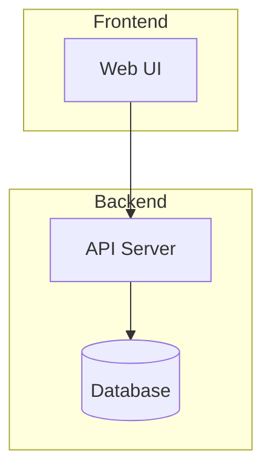

## 1. エグゼクティブサマリー

[このシステムが何を解決し、どのような価値を提供するかを3-5行で記述]

**関連文書:**

- PRD: [link]
- 主要ADR: [ADR-001], [ADR-002]

## 2. システム概要

### 2.1 システム構成図



### 2.2 主要コンポーネント

| コンポーネント | 責務                      | 技術              |
| -------------- | ------------------------- | ----------------- |
| Web UI         | ユーザーインターフェース  | React             |
| API Server     | ビジネスロジック、API提供 | Node.js + Express |
| Database       | データ永続化              | PostgreSQL        |

## 3. 技術選択

| 領域           | 技術          | 選択理由                 |
| -------------- | ------------- | ------------------------ |
| Frontend       | React         | [簡潔な理由/ADRのリンク] |
| Backend        | Node.js       | [簡潔な理由/ADRのリンク] |
| Database       | PostgreSQL    | [簡潔な理由/ADRのリンク] |
| Infrastructure | [AWS/GCP/etc] | [簡潔な理由/ADRのリンク] |

## 4. API設計概要

### 主要エンドポイント

| Method | Path                    | 用途   |
| ------ | ----------------------- | ------ |
| GET    | /api/v1/[resources]     | [用途] |
| POST   | /api/v1/[resources]     | [用途] |
| PUT    | /api/v1/[resources]/:id | [用途] |
| DELETE | /api/v1/[resources]/:id | [用途] |

## 5. データモデル概要

### 主要エンティティ

```yaml
User:
  - id: uuid
  - email: string
  - name: string
  - created_at: timestamp

[その他の主要エンティティ]
```

## 6. 非機能要件の実現

### 6.1 パフォーマンス

- **目標レスポンスタイム:** < 500ms
- **想定同時ユーザー数:** 100人

### 6.2 セキュリティ

- **認証:** JWT
- **HTTPS:** 必須
- **データ保護:** [基本的な方針]

### 6.3 可用性

- **稼働率目標:** 99%
- **バックアップ:** 日次

## 7. 開発・デプロイ

### 7.1 開発環境

- **ローカル開発:** Docker Compose
- **CI/CD:** GitHub Actions
- **コード管理:** GitHub

### 7.2 環境構成

| 環境        | 用途         | 構成               |
| ----------- | ------------ | ------------------ |
| Development | 開発・テスト | ローカル/Docker    |
| Production  | 本番         | [クラウドサービス] |

## 8. 今後の検討事項

- [将来的に検討すべき拡張・改善点]
- [現時点では対応しない要件]

## 9. 参考資料

- [関連する技術ドキュメントへのリンク]
- [参考にしたアーキテクチャパターン]
