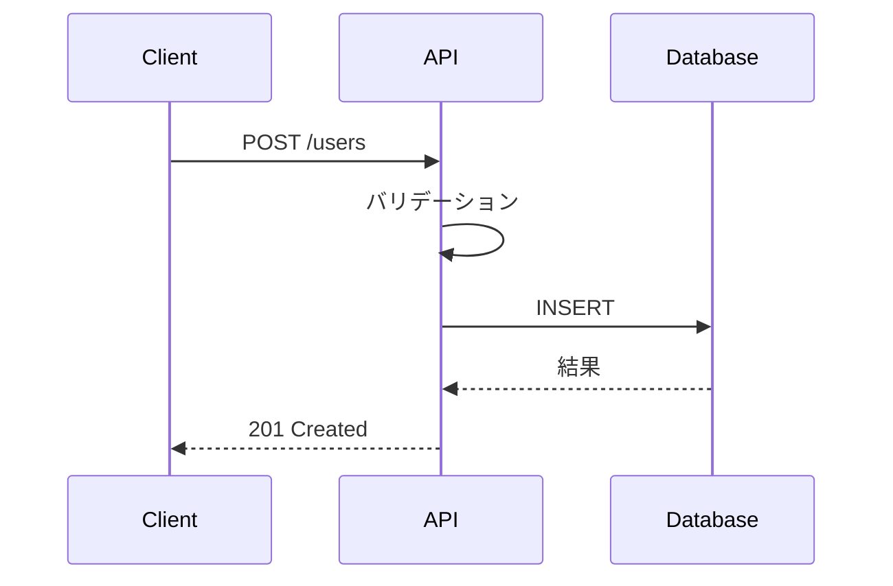

## 1. サービス概要

**サービス名:** [Service Name]  
**責務:** [このサービスの主要な責務を1-2行で]  
**依存関係:** [依存する他のサービス/DB等]

## 2. API詳細設計

### 2.1 エンドポイント一覧

| Method | Path              | 説明             | Request Body  | Response |
| ------ | ----------------- | ---------------- | ------------- | -------- |
| GET    | /api/v1/users     | ユーザー一覧取得 | -             | User[]   |
| POST   | /api/v1/users     | ユーザー作成     | CreateUserDto | User     |
| GET    | /api/v1/users/:id | ユーザー詳細取得 | -             | User     |
| PUT    | /api/v1/users/:id | ユーザー更新     | UpdateUserDto | User     |

### 2.2 データモデル

```typescript
// Request/Response型定義
interface User {
  id: string;
  email: string;
  name: string;
  createdAt: Date;
  updatedAt: Date;
}

interface CreateUserDto {
  email: string;
  name: string;
}

interface UpdateUserDto {
  name?: string;
}
```

## 3. 内部設計

### 3.1 処理フロー例（ユーザー作成）



### 3.2 主要な処理

- **バリデーション:** [入力値の検証ルール]
- **ビジネスロジック:** [主要な処理内容]
- **エラーハンドリング:** [エラー時の対応]

## 4. データベース設計

```sql
-- 主要テーブル定義
CREATE TABLE users (
    id UUID PRIMARY KEY DEFAULT gen_random_uuid(),
    email VARCHAR(255) UNIQUE NOT NULL,
    name VARCHAR(255) NOT NULL,
    created_at TIMESTAMP DEFAULT NOW(),
    updated_at TIMESTAMP DEFAULT NOW()
);

-- インデックス
CREATE INDEX idx_users_email ON users(email);
```

## 5. エラーハンドリング

| エラーコード     | HTTP Status | 説明                   |
| ---------------- | ----------- | ---------------------- |
| USER_NOT_FOUND   | 404         | ユーザーが見つからない |
| VALIDATION_ERROR | 400         | 入力値が不正           |
| DUPLICATE_EMAIL  | 409         | メールアドレスが重複   |

## 6. 実装上の注意点

- [実装時に注意すべきポイント]
- [パフォーマンス考慮事項]
- [セキュリティ考慮事項]
