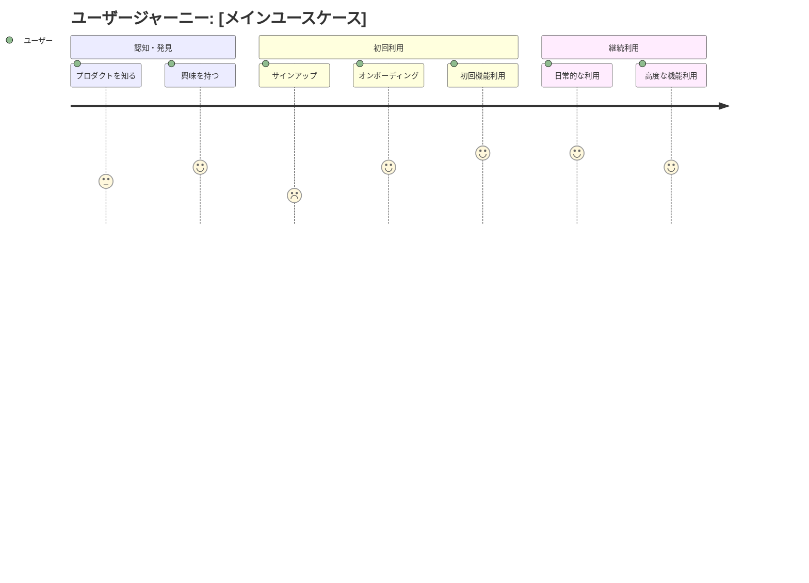

# [プロダクト名]

---

## エグゼクティブサマリー

### プロダクト概要

[2-3文でプロダクトの核心価値を説明]

### ビジネス価値

- **主要目標:** [具体的で測定可能な目標]
- **期待効果:** [定量的な効果指標]
- **戦略的意義:** [会社・事業戦略との関連]

### 成功指標（KPI）

| 指標     | 現在値     | 目標値     | 測定方法   | 達成期限 |
| -------- | ---------- | ---------- | ---------- | -------- |
| [指標名] | [現在の値] | [目標の値] | [測定手法] | [期限]   |
| [指標名] | [現在の値] | [目標の値] | [測定手法] | [期限]   |

---

## 1. 背景・コンテキスト

### 1.1 現状分析

**市場・ユーザーの現状:**

- [市場の状況、トレンド]
- [ユーザーの現在の行動パターン]
- [競合他社の状況]

**解決すべき課題:**

- [課題1: 具体的な問題と影響範囲]
- [課題2: 数値で示せる問題の規模]
- [課題3: ユーザーの痛み、不満]

**機会とタイミング:**

- [市場機会]
- [技術的機会]
- [競合状況から見たタイミング]

### 1.2 戦略的位置づけ

**事業戦略との関係:**
[このプロダクトが事業戦略にどのように貢献するか]

**既存プロダクトとの関係:**
[既存のプロダクト・サービスとの関係、統合方針]

---

## 2. ターゲットユーザー

### 2.1 プライマリーユーザー

#### ペルソナ1: [ペルソナ名]

- **属性:** [年齢、職業、技術習熟度等]
- **現在の行動:** [このプロダクト領域での現在の行動]
- **課題・ニーズ:** [抱えている課題、求めているもの]
- **目標:** [達成したいこと]
- **利用コンテキスト:** [いつ、どこで、なぜ使うか]

#### ペルソナ2: [ペルソナ名]

[同様の形式で記述]

### 2.2 セカンダリーユーザー

[間接的に影響を受ける、または関与するユーザー]

### 2.3 ユーザー優先度

| ユーザー層    | 優先度 | 理由           | 想定規模         |
| ------------- | ------ | -------------- | ---------------- |
| [ユーザー層1] | P0     | [優先する理由] | [想定ユーザー数] |
| [ユーザー層2] | P1     | [優先する理由] | [想定ユーザー数] |

---

## 3. ユーザーストーリー・ユースケース

### 3.1 コアユーザーストーリー

#### ストーリー1: [ストーリー名]

**As a** [ユーザー役割]  
**I want** [欲しい機能・行動]  
**So that** [得たい価値・結果]

**詳細シナリオ:**

1. [ステップ1: 具体的な行動]
2. [ステップ2: システムの応答]
3. [ステップ3: ユーザーの次の行動]
4. [結果: 達成される価値]

**受け入れ基準:**

- [ ] [基準1: 測定可能な基準]
- [ ] [基準2: 測定可能な基準]
- [ ] [基準3: 測定可能な基準]

#### ストーリー2: [ストーリー名]

[同様の形式で記述]

#### ストーリー3: [ストーリー名]

[同様の形式で記述]

### 3.2 サポートユーザーストーリー

[コア機能を支える補助的なストーリー]

### 3.3 将来的なユーザーストーリー

[今回のスコープ外だが、将来検討したいストーリー]

---

## 4. 機能要件

### 4.1 必須機能（Must Have）

#### 機能1: [機能名]

**目的:** [この機能の目的・価値]  
**対象ユーザー:** [どのユーザーが使うか]  
**優先度:** P0

**詳細仕様:**

- [具体的な動作・機能]
- [入力・出力の仕様]
- [制約条件]

**受け入れ基準:**

- [ ] [基準1]
- [ ] [基準2]
- [ ] [基準3]

#### 機能2: [機能名]

[同様の形式で記述]

### 4.2 推奨機能（Should Have）

[重要だが必須ではない機能]

### 4.3 拡張機能（Could Have）

[あると良いが優先度の低い機能]

### 4.4 機能外（Won't Have）

**今回のスコープ外:**

- [機能1: スコープ外の理由]
- [機能2: 将来バージョンでの検討事項]

---

## 5. 非機能要件

### 5.1 パフォーマンス要件

| 項目               | 目標値    | 測定方法     | 優先度 |
| ------------------ | --------- | ------------ | ------ |
| ページ読み込み時間 | 3秒以下   | [測定ツール] | P0     |
| API応答時間        | 500ms以下 | [測定ツール] | P0     |
| 同時利用者数       | 1000人    | [負荷テスト] | P1     |

### 5.2 ユーザビリティ要件

- **アクセシビリティ:** [WCAG 2.1 AA準拠等]
- **ブラウザ対応:** [サポート対象ブラウザ]
- **デバイス対応:** [PC、モバイル、タブレット等]
- **言語対応:** [多言語対応の有無]

### 5.3 セキュリティ要件

- **認証・認可:** [必要な認証レベル]
- **データ保護:** [個人情報保護要件]
- **コンプライアンス:** [準拠すべき規格・法規制]

### 5.4 可用性・信頼性

- **稼働率:** [99.9%等の目標値]
- **復旧時間:** [障害時の復旧目標時間]
- **バックアップ:** [データバックアップ要件]

---

## 6. ユーザーエクスペリエンス

### 6.1 ユーザージャーニー

### 6.2 主要画面・フロー

#### 画面1: [画面名]

- **目的:** [この画面の目的]
- **表示内容:** [主要な表示要素]
- **ユーザーアクション:** [可能なアクション]
- **遷移:** [他画面への遷移]

#### 画面2: [画面名]

[同様の形式で記述]

### 6.3 UI/UX指針

- **デザイン原則:** [統一性、シンプルさ等]
- **ブランド整合性:** [既存ブランドとの整合性]
- **ユーザビリティ:** [使いやすさの重視点]

---

## 7. 制約・前提条件

### 7.1 技術的制約

- **既存システム:** [既存システムとの連携制約]
- **技術スタック:** [使用必須の技術]
- **パフォーマンス:** [技術的なパフォーマンス制限]
- **セキュリティ:** [技術的なセキュリティ制約]

### 7.2 ビジネス制約

- **予算:** [予算制限]
- **リソース:** [人的リソース制約]
- **法的制約:** [法規制、コンプライアンス要件]
- **パートナー:** [外部パートナーとの関係]

### 7.3 外部依存

- **外部サービス:** [依存する外部サービス・API]
- **サードパーティ:** [サードパーティツール・ライブラリ]
- **インフラ:** [インフラ・プラットフォーム依存]

### 7.4 前提条件

- **ユーザー環境:** [想定するユーザーの技術環境]
- **データ:** [利用可能なデータ・データ品質]
- **組織:** [組織体制・プロセスの前提]

---

## 8. 競合分析

### 8.1 主要競合

#### 競合A: [競合名]

- **強み:** [競合の強み]
- **弱み:** [競合の弱み]
- **差別化ポイント:** [我々の差別化要素]
- **学習ポイント:** [学ぶべき点]

#### 競合B: [競合名]

[同様の形式で記述]

### 8.2 競合比較表

| 項目    | 自社プロダクト | 競合A   | 競合B   | 差別化要素   |
| ------- | -------------- | ------- | ------- | ------------ |
| [機能1] | [有/無]        | [有/無] | [有/無] | [差別化内容] |
| [機能2] | [有/無]        | [有/無] | [有/無] | [差別化内容] |
| [価格]  | [価格]         | [価格]  | [価格]  | [価格優位性] |

### 8.3 市場ポジション

[市場における自社の位置づけと戦略]

---

## 9. 成功・リスク分析

### 9.1 成功要因

- **要因1:** [成功に必要な要因]
- **要因2:** [達成すべき条件]
- **要因3:** [重要な前提条件]

### 9.2 主要リスク

| リスク    | 影響度   | 発生確率 | 軽減策           | 担当者   |
| --------- | -------- | -------- | ---------------- | -------- |
| [リスク1] | 高/中/低 | 高/中/低 | [具体的な軽減策] | [担当者] |
| [リスク2] | 高/中/低 | 高/中/低 | [具体的な軽減策] | [担当者] |

### 9.3 重要な仮説

- **仮説1:** [検証すべき仮説]
- **仮説2:** [重要な前提となる仮説]
- **検証方法:** [仮説を検証する方法]

---

## 10. 実装・ローンチ計画

### 10.1 MVP（Minimum Viable Product）

**MVP スコープ:**

- [MVP に含める最小機能セット]
- [検証したい仮説]
- [MVP での成功指標]

**MVP 後の拡張計画:**

- [フェーズ2で追加する機能]
- [フェーズ3以降の計画]

### 10.2 ローンチ戦略

**ターゲットセグメント:**
[最初にローンチするユーザーセグメント]

**ローンチ方法:**

- [ベータテスト]
- [段階的ロールアウト]
- [マーケティング戦略]

### 10.3 成功測定

**測定方法:**

- [定量指標の測定方法]
- [定性フィードバックの収集方法]
- [レビュー・改善サイクル]

---

## 11. ステークホルダー・承認

### 11.1 関係者

| 役割                         | 名前   | 責任範囲   | 承認権限   |
| ---------------------------- | ------ | ---------- | ---------- |
| プロダクトオーナー           | [名前] | [責任範囲] | [承認事項] |
| エンジニアリングマネージャー | [名前] | [責任範囲] | [承認事項] |
| デザインリード               | [名前] | [責任範囲] | [承認事項] |
| ビジネス責任者               | [名前] | [責任範囲] | [承認事項] |

### 11.2 コミュニケーション計画

- **定期レビュー:** [頻度と参加者]
- **進捗報告:** [報告方法と頻度]
- **意思決定プロセス:** [重要な決定の流れ]

### 11.3 承認記録

| 項目         | 承認者     | 承認日     | コメント   |
| ------------ | ---------- | ---------- | ---------- |
| PRD承認      | [承認者名] | YYYY-MM-DD | [コメント] |
| 追加要件承認 | [承認者名] | YYYY-MM-DD | [コメント] |

---

## 付録

### A. 用語集

| 用語    | 定義   |
| ------- | ------ |
| [用語1] | [定義] |
| [用語2] | [定義] |

### B. 参考資料

- [市場調査レポート]
- [ユーザーリサーチ結果]
- [競合分析資料]
- [技術調査結果]

### C. 変更履歴

| バージョン | 日付       | 変更内容   | 変更者   |
| ---------- | ---------- | ---------- | -------- |
| v1.0       | YYYY-MM-DD | 初版作成   | [作成者] |
| v1.1       | YYYY-MM-DD | [変更内容] | [変更者] |
